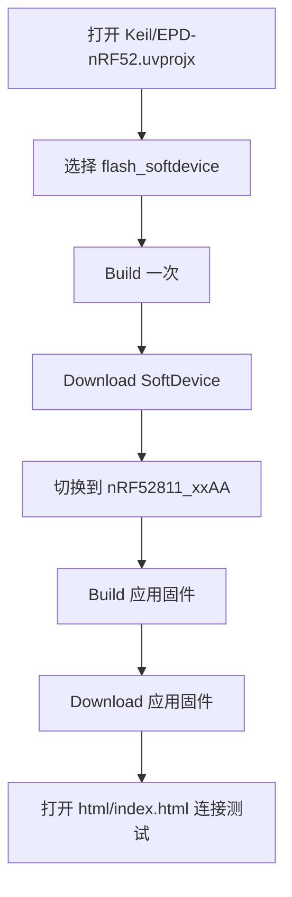
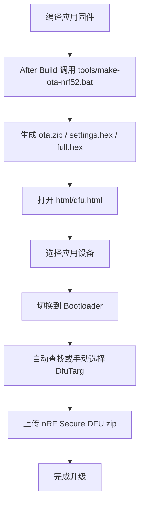

# nRF_EPD

面向 `nRF52811` 电子价签与墨水屏设备的开源项目，重点适配盒马 / 阿里系 `nRF52811` 价签，并围绕当前工程提供完整的固件、网页控制台、DFU 和调试工具链。

项目基于 [tsl0922/EPD-nRF5](https://github.com/tsl0922/EPD-nRF5) 持续扩展，当前仓库已经包含：

- MCU 固件
- Secure DFU Bootloader 工程
- Web Bluetooth 控制台
- 独立 Nordic DFU 升级页
- Windows GUI 模拟器
- Keil 编译体积分析辅助工具
- Nordic SDK 17.1.0
- 设备资料、协议说明和开发文档

## 目录

- [项目定位](#项目定位)
- [仓库结构](#仓库结构)
- [发布亮点](#发布亮点)
- [版本发布与下载](#版本发布与下载)
- [功能概览](#功能概览)
- [支持设备](#支持设备)
- [屏幕与驱动型号对照表](#屏幕与驱动型号对照表)
- [快速开始](#快速开始)
- [固件编译与刷机](#固件编译与刷机)
- [典型刷机流程图](#典型刷机流程图)
- [模拟器编译](#模拟器编译)
- [网页端使用说明](#网页端使用说明)
- [DFU 升级说明](#dfu-升级说明)
- [协议与低电量行为](#协议与低电量行为)
- [FAQ](#faq)
- [文档导航](#文档导航)

## 项目定位

这个仓库不是单一固件工程，而是一套完整的墨水屏开发工具链，覆盖了从驱动适配、界面显示、BLE 通信，到网页控制、图片传输、OTA 升级、模拟调试的整个流程。

适合以下场景：

- 盒马 / 阿里 `nRF52811` 电子价签二次开发
- 墨水屏 BLE 传图与控制
- Buttonless DFU 升级流程接入
- GUI 逻辑本地模拟与调试

## 仓库结构

```text
nRF_EPD/
├─ EPD/        墨水屏驱动、配置、BLE 服务实现
├─ GUI/        日历、时钟、字体和界面绘制逻辑
├─ html/       Web Bluetooth 控制台与独立 DFU 页面
├─ Keil/       应用固件工程、DFU Bootloader 工程、分析输出
├─ SDK/        Nordic nRF5 SDK 17.1.0
├─ tools/      OTA 打包、SoftDevice 中转、密钥与工具
├─ docs/       设备资料、开发说明、协议说明、数据手册
├─ main.c      固件入口
├─ keil5_disp_size_bar.exe  Keil 编译后显示 Flash/RAM 占用的辅助工具
├─ Makefile.nRF52
├─ Makefile.win32
└─ emulator.c  Windows 模拟器入口
```

## 发布亮点

如果你是第一次看到这个仓库，可以把它理解成一套围绕电子价签开发的“发布可用工具箱”：

- 固件侧已经集成 BLE 控制、图像传输、时钟/日历界面、低电量保护与 Buttonless DFU
- 网页侧已经提供主控台和独立 DFU 升级页，适合直接部署给测试或现场使用
- 工程侧同时保留了应用固件工程和独立 DFU Bootloader 工程，方便完整交付
- 调试侧提供 `emulator.exe`，可以在 Windows 本地快速预览 GUI 效果
- 构建侧提供 `keil5_disp_size_bar.exe`，便于在 Keil 编译后快速观察程序体积占用

## 版本发布与下载

如果你是使用者而不是开发者，建议优先从 Releases 获取现成产物：

- 发布页：https://github.com/YCD12/nRF_EPD/releases
- 源码主页：https://github.com/YCD12/nRF_EPD

发布产物建议关注这几类：

- `application.hex`
  适合已经完成 SoftDevice / Bootloader 基础环境的设备，仅更新应用固件
- `ota.zip`
  适合通过 `html/dfu.html` 或 Nordic Secure DFU 工具进行无线升级
- `full.hex`
  适合产线、首刷或全量恢复场景，通常包含 SoftDevice、Bootloader、Application、settings
- `bootloader.hex`
  用于独立烧录或替换 DFU Bootloader

如果你准备自己维护发布版本，推荐在 Release 说明里明确写清：

- 适用硬件型号
- 屏幕尺寸和驱动 IC
- 是否包含 SoftDevice
- 是否包含 Bootloader
- 推荐刷机方式：直刷 / OTA / 全量恢复

一个常见的发布包组合可以是：

- `nrf_epd_app.hex`
- `nrf_epd_ota.zip`
- `nrf_epd_full.hex`
- `release-notes.md`

## 功能概览

### 1. MCU 固件

- 基于 Nordic BLE 外设模式广播，设备名为 `NRF_EPD`
- 内置 `EPD` 自定义 BLE 服务，支持控制命令、状态通知和图像传输
- 支持图片模式、日历模式、时钟模式、时钟+日历模式
- 支持运行时设置屏幕驱动和引脚映射
- 支持多种电子纸控制器与不同尺寸屏幕组合
- 支持 `Buttonless DFU`，可从应用固件无按键切入 Bootloader
- 支持看门狗、RTT 日志、BLE 参数协商
- 支持电池电压采样、低电量页和临界关机保护

### 1.1 Secure DFU Bootloader 工程

- 独立工程文件：`Keil/DFU-nRF52.uvprojx`
- 基于 Nordic Secure DFU Bootloader
- 对应源码入口位于 `SDK/17.1.0_ddde560/dfu/main.c`
- 用于构建可与应用固件配套使用的 BLE DFU Bootloader
- 与 `tools/bootloader/bl_nrf52811_xxaa_s112.hex`、网页 DFU 页面和 OTA 打包脚本相互配合

### 2. 图片传输

- 支持传统 `WRITE_IMAGE` 方式
- 支持 `WRITE_BLOCK + CRC16` 分块校验传输
- 支持断点续传、丢块补发、状态查询
- 支持黑白层和彩色层分层发送
- 适合移动端和浏览器场景下更稳定地传图

### 3. Web 控制台

主页入口：`html/index.html`

- 蓝牙连接、重连、设备过滤、日志查看
- 屏幕驱动选择与引脚配置下发
- 日历模式 / 时钟模式切换
- 连接后自动读取固件版本、时间、MTU、电池电压
- 图片上传、抖动处理、旋转、镜像、翻转、裁剪
- 手绘、文字工具、待办清单、课表生成
- 支持多种画布尺寸、双色 / 三色 / 四色 / 六色模式

### 4. 独立 DFU 升级页

升级页入口：`html/dfu.html`

- 独立于主页连接状态，避免日常控制和升级流程互相干扰
- 按 Nordic `unbonded buttonless DFU` 流程引导升级
- 支持 Nordic `nRF Secure DFU` 的 `.zip` 固件包
- 支持自动切换到 Bootloader
- 支持自动查找或手动选择 `DfuTarg`
- 支持环境自检、升级会话恢复、手动继续和会话放弃

### 5. 本地模拟器

- 可以在 Windows 下直接运行 GUI 代码
- 修改 `GUI/` 后无需每次烧录到硬件即可查看界面效果
- 适合调试字体、布局、日历与时钟绘制逻辑

### 6. Keil 构建辅助工具

- `keil5_disp_size_bar.exe` 会在 `Keil/EPD-nRF52.uvprojx` 编译完成后自动运行
- 用于辅助查看当前固件的 Flash / RAM 占用情况
- 适合在持续迭代功能时快速观察体积变化，判断是否逼近芯片资源上限

## 支持设备

当前 README 以 `nRF52811` 工程为准，当前支持定位为：

- `nrf52811`

- 盒马 / 阿里 `nRF52811`

当前建议按以下状态理解：

- 已支持：`nRF52811`
- 主线验证中：`nRF52811 + 7.5寸 UC8179 三色屏`
- 预留适配项：网页工具里保留的其他屏幕尺寸、颜色模式和驱动选项

如果后续重新扩展到其他 MCU 或历史驱动板，建议单独在文档中拆分“历史适配”章节，避免和当前主线工程混淆。

## 屏幕与驱动型号对照表

### 已支持 / 主线验证中

根据当前固件主线代码：

- 默认配置来自 `EPD_CFG_52811`
- 默认 `model_id = 0x07`
- 当前底层驱动 IC 枚举仅包含 `UC8179`
- 当前模型表仅包含 `7.5 寸黑白红三色屏（UC8179）`

因此，当前主线工程应以这组配置为准：

| 项目 | 当前主线值 |
| --- | --- |
| MCU | `nRF52811` |
| 默认模型 ID | `0x07` |
| 默认驱动 IC | `UC8179` |
| 主线屏幕规格 | `7.5 寸` |
| 主线颜色类型 | 黑白红三色 |
| 主线分辨率 | `800x480` |
| 说明 | 当前固件主线和时钟/局刷逻辑围绕该配置维护 |

建议按状态理解：

- 已支持：`nRF52811` 平台
- 主线验证中：`UC8179 / 7.5寸 / 800x480 / 三色`
- 预留适配项：网页端下拉框中保留的其他尺寸与驱动组合

### 预留适配项（网页工具内置预置）

下面这张表按当前 `html/index.html` 里的驱动选择器整理，表示网页工具内置的屏幕/驱动预置项。

注意：

- 这些选项首先是网页端的图像处理和尺寸预置入口
- 不应直接理解为“当前 nRF52811 固件主线已经完整验证这些组合”
- 如果固件侧没有对应模型/驱动实现，仅切换网页选项并不能自动获得完整支持

| 驱动值 | 屏幕规格 | 颜色 | 驱动 IC | 画布尺寸 |
| --- | --- | --- | --- | --- |
| `01` | 4.2 寸 | 黑白 | `UC8176` | `400x300` |
| `03` | 4.2 寸 | 三色 | `UC8176` | `400x300` |
| `04` | 4.2 寸 | 黑白 | `SSD1619` | `400x300` |
| `02` | 4.2 寸 | 三色 | `SSD1619` | `400x300` |
| `05` | 4.2 寸 | 四色 | `JD79668` | `400x300` |
| `06` | 7.5 寸 | 黑白 | `UC8179` | `800x480` |
| `07` | 7.5 寸 | 三色 | `UC8179` | `800x480` |
| `0c` | 7.5 寸 | 四色 | `JD79668` | `800x480` |
| `08` | 7.5 寸低分 | 黑白 | `UC8159` | `640x384` |
| `09` | 7.5 寸低分 | 三色 | `UC8159` | `640x384` |
| `0a` | 7.5 寸 HD | 黑白 | `SSD1677` | `880x528` |
| `0b` | 7.5 寸 HD | 三色 | `SSD1677` | `880x528` |

补充说明：

- 网页端画布尺寸与驱动选择会联动，建议先选驱动，再确认传图尺寸
- 同尺寸屏幕不代表驱动 IC 一定相同，接错驱动类型会导致刷新异常或显示错乱
- 当前 `nRF52811` 主线建议优先按 `UC8179 / 7.5寸 / 800x480 / 三色` 这一组合理解和使用
- 真实硬件适配除了尺寸和驱动 IC，还需要确认引脚映射、唤醒脚和 LED 配置

## 快速开始

如果你是第一次接手这个项目，推荐按下面顺序上手：

1. 先读 [docs/develop.md](docs/develop.md) 了解整体开发方式。
2. 用 Keil 打开 `Keil/EPD-nRF52.uvprojx`，先编译应用固件。
3. 如需完整 OTA 链路，再打开 `Keil/DFU-nRF52.uvprojx` 了解 Bootloader 工程。
4. 需要看界面时，用 `Makefile.win32` 编译 `emulator.exe`。
5. 需要日常控制设备时，打开 `html/index.html` 对应网页。
6. 需要升级固件时，进入 `html/dfu.html` 使用独立 DFU 页面。
7. 需要查命令和通知格式时，查看 [docs/ble-protocol.md](docs/ble-protocol.md)。

## 固件编译与刷机

### 方式一：Keil 编译（推荐）

推荐环境：

- `Keil 5.36` 或更低版本
- J-Link 或 DAPLink

工程文件：

- `Keil/EPD-nRF52.uvprojx`：应用固件
- `Keil/DFU-nRF52.uvprojx`：Secure DFU Bootloader

当前 nRF52 工程常用 Target：

- `nRF52811_xxAA`：应用固件
- `flash_softdevice`：安全中转并烧录 SoftDevice

Keil 工程配套说明：

- `Keil/EPD-nRF52.uvprojx` 在编译完成后会自动调用 `tools/make-ota-nrf52.bat` 生成 OTA 相关产物
- 同时会自动调用 `keil5_disp_size_bar.exe`，辅助查看当前构建结果的 Flash / RAM 占用
- `Keil/DFU-nRF52.uvprojx` 用于单独编译 BLE Secure DFU Bootloader，适合需要完整升级链路的场景

推荐刷机流程：

1. 全片擦除目标板。
2. 在 Keil 中切换到 `flash_softdevice`。
3. 先执行一次 `Build`。
4. 再执行 `Download`，刷入 `s112_nrf52_7.3.0` SoftDevice。
5. 切回 `nRF52811_xxAA`，编译并下载应用固件。

注意事项：

- 当前仓库的安全流程会把 SoftDevice 中转到 `Keil/_build_softdevice_nRF52/`，避免误删 SDK 原始文件。
- 如果 `flash_softdevice` 构建时报缺少 `s112_nrf52_7.3.0_softdevice.hex`，请检查 `SDK/17.1.0_ddde560/components/softdevice/s112/hex/`。
- 这部分背景可参考 [docs/flash_softdevice_safe_refactor_summary.md](docs/flash_softdevice_safe_refactor_summary.md)。

### 方式二：命令行 GCC 编译

入口文件：`Makefile.nRF52`

适合已经具备 Nordic GCC 环境的开发者。需要准备：

- `make`
- `arm-none-eabi-gcc` 工具链
- `nrfjprog`（如需命令行刷机）

常用命令：

```bash
make -f Makefile.nRF52
make -f Makefile.nRF52 flash
make -f Makefile.nRF52 flash_softdevice
make -f Makefile.nRF52 erase
```

说明：

- 默认编译目标是 `nrf52811_xxaa`
- `flash` 会烧录应用固件
- `flash_softdevice` 会烧录 `s112_nrf52_7.3.0` SoftDevice
- `erase` 会执行全片擦除
- 如果你主要使用 Keil，仍然建议优先走 `flash_softdevice` 的安全中转流程

### 方式三：生成 DFU/OTA 包

工具脚本：`tools/make-ota-nrf52.bat`

脚本能力：

- 生成 Nordic Secure DFU 使用的 `.zip`
- 生成 settings hex
- 合并 SoftDevice、Bootloader、Application 为完整 hex

相关资源：

- 私钥：`tools/priv.pem`
- Bootloader：`tools/bootloader/bl_nrf52811_xxaa_s112.hex`
- `nrfutil`、`mergehex`：`tools/bin/`

如果你直接在 `Keil/EPD-nRF52.uvprojx` 中执行编译，工程的 After Build 步骤也会自动调用该脚本生成 OTA 相关产物。

## 典型刷机流程图

### 1. 本地编译并直刷设备



### 2. 生成 OTA 包并网页升级



## 模拟器编译

模拟器入口：`emulator.c`

Windows 下可以通过 `Makefile.win32` 直接编译：

1. 安装 [MSYS2](https://www.msys2.org)
2. 打开 `MSYS2 MINGW64`
3. 安装依赖

```bash
pacman -Syu
pacman -S make mingw-w64-x86_64-gcc
```

4. 在项目目录执行

```bash
make -f Makefile.win32
```

生成产物：

- `emulator.exe`

说明：

- 修改 `GUI/` 下代码后重新执行上述命令即可
- `GUI/` 目录尽量不要直接依赖 MCU 平台 API，否则模拟器无法编译
- 模拟器当前主要用于预览 `400x300` 电子纸界面
- 默认可查看日历模式与时钟模式
- 键盘交互包括：`空格` 切换模式、`R` 切换颜色模式、`W` 切换周起始日、方向键调整日期/月视图
- 它更适合验证 GUI 逻辑与显示效果，不等价于完整 MCU/BLE 行为模拟

## 网页端使用说明

### 主页面

入口：`html/index.html`

主页负责：

- 连接设备并打开通知
- 下发驱动与引脚配置
- 执行时钟 / 日历模式控制
- 查看电池电压与低电量提示
- 图片处理后通过 BLE 发送到设备

### 运行建议

网页端使用 Web Bluetooth，建议通过安全上下文访问页面：

- `https://`
- `http://localhost`

项目已经内置环境检查与兼容提示。实际升级流程建议从主页跳转到独立 DFU 页，不再在主页内部直接做 DFU。

## DFU 升级说明

入口：`html/dfu.html`

当前流程要点：

1. 选择 `nRF Secure DFU` 固件包 `.zip`
2. 选择应用设备
3. 发送 Buttonless 命令切换到 Bootloader
4. 自动查找或手动选择 `DfuTarg`
5. 完成升级

页面还支持：

- 环境自检
- 手动选择 `DfuTarg` 时显示全部蓝牙设备，并在选择后尽量校验，正式连接时再次确认是否为 DFU Bootloader
- 多镜像升级过程中的手动继续
- 可恢复会话保护
- 放弃当前会话
- 从手动 `DfuTarg` 模式恢复到默认流程

## 协议与低电量行为

BLE 协议详情见 [docs/ble-protocol.md](docs/ble-protocol.md)。

当前值得关注的几点：

- `EPD_CMD_INIT (0x01)`：初始化驱动，并上报 `mtu`、时间、电压
- `EPD_CMD_SET_TIME (0x20)`：设置时间并立即刷新
- `EPD_CMD_SET_WEEK_START (0x21)`：设置周起始日
- `EPD_CMD_SET_MODE (0x22)`：切换图片 / 日历 / 时钟 / 时钟+日历模式
- `EPD_CMD_SYNC_TIME_SILENT (0x23)`：静默校时，不立即刷新，仅固件 `>= 0x21` 支持
- `EPD_CMD_WRITE_BLOCK (0x31)`：带 CRC16 的分块传图
- `EPD_CMD_QUERY_STATUS (0x32)` / `EPD_CMD_RESET_TRANSFER (0x33)`：断点续传相关命令

低电量行为：

- `<= 2800mV`：进入低电量页面，停止正常自动刷新
- `< 2700mV`：显示 `power off` 后进入 `SYSOFF`
- 低电量页激活后每 `10` 秒轮询一次电压

## FAQ

### 1. 我只是想刷固件，不想自己编译，需要先刷 SoftDevice 吗？

如果你使用的是已经打包好的完整发布固件，通常不需要手动单独处理 SoftDevice。  
如果你是基于当前仓库自己编译应用固件，再按本文档流程刷机，建议先刷一次 `s112_nrf52_7.3.0` SoftDevice。

### 2. `EPD-nRF52.uvprojx` 和 `DFU-nRF52.uvprojx` 分别是干什么的？

- `Keil/EPD-nRF52.uvprojx`：应用固件工程，负责屏幕驱动、BLE 服务、图片传输、界面模式等主功能
- `Keil/DFU-nRF52.uvprojx`：Secure DFU Bootloader 工程，负责 OTA 升级链路

### 2.1 当前哪些内容是“已经支持”，哪些是“后续预留”？

- 已支持：`nRF52811` 主线工程、应用固件、DFU Bootloader、网页控制台、独立 DFU 页
- 主线验证中：`UC8179 / 7.5寸 / 800x480 / 三色` 这一组当前默认配置
- 预留适配项：网页工具里仍保留的其他屏幕尺寸、驱动和颜色模式，后续可逐步接入固件主线

### 3. `keil5_disp_size_bar.exe` 是必须的吗？

不是必须。它主要用于在 Keil 编译完成后辅助查看 Flash / RAM 占用，方便你判断资源余量。  
即使不关注体积分析，也不影响固件本身功能。

### 4. `emulator.exe` 能替代真机调试吗？

不能完全替代。它更适合验证 `GUI/` 里的界面绘制逻辑、字体布局和日历/时钟显示效果。  
BLE 连接、真实墨水屏刷新、电源与低电量行为，仍然需要在真机上验证。

### 5. 网页端为什么建议分成主页和独立 DFU 页？

因为日常控制连接和升级连接属于两条不同流程。  
当前仓库把 DFU 拆到 `html/dfu.html`，可以避免主页的 BLE 连接状态影响升级稳定性。

### 6. Web 页面为什么要用 `https://` 或 `localhost` 打开？

因为 Web Bluetooth 依赖安全上下文。  
如果不是 `https://` 或 `http://localhost`，浏览器通常不会允许页面访问蓝牙设备。

### 7. 传图不稳定时先看什么？

建议先检查这几项：

- 浏览器是否支持 Web Bluetooth
- 当前访问环境是否为安全上下文
- MTU、确认间隔设置是否过激
- 设备是否低电量
- 是否已经切换到了正确的屏幕驱动和画布尺寸

## 文档导航

- 开发说明：[docs/develop.md](docs/develop.md)
- BLE 协议：[docs/ble-protocol.md](docs/ble-protocol.md)
- SoftDevice 安全刷写说明：[docs/flash_softdevice_safe_refactor_summary.md](docs/flash_softdevice_safe_refactor_summary.md)
- 应用工程：`Keil/EPD-nRF52.uvprojx`
- Bootloader 工程：`Keil/DFU-nRF52.uvprojx`
- 数据手册：`docs/datasheets/`
- OTP/LUT 参考：`docs/OTP/`

## 版本说明

- `V0.0.1`：同步上游 `tsl0922/EPD-nRF5`，作为当前项目演进基础
