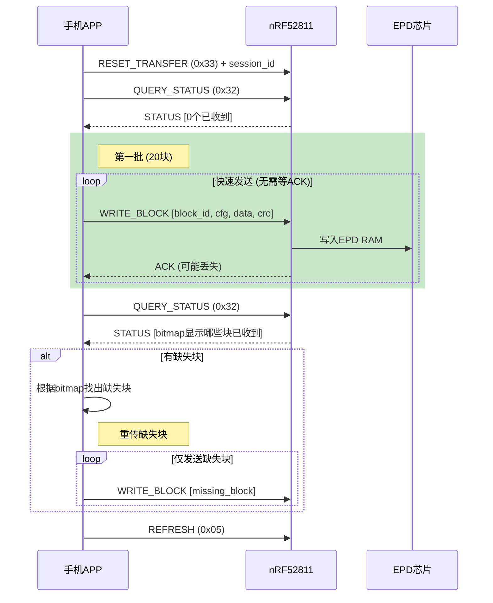
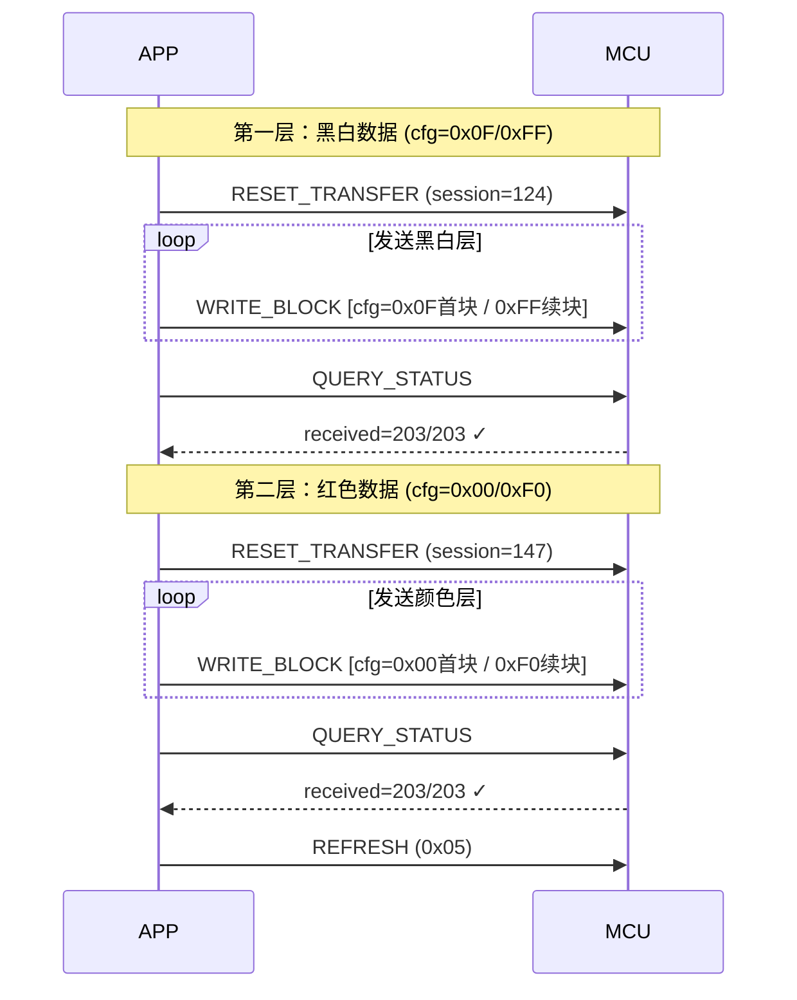

# BLE图像传输数据完整性保护方案（含断点续传）

> **版本**: v2.0 (2026-02-01)
> **状态**: 已实现并测试

## 问题分析

当前流式传输存在的问题：
- **无校验机制**：数据包直接写入EPD RAM，无法检测丢包或损坏
- **不可恢复**：一旦数据丢失，无法重传，导致显示错乱  
- **断连后丢失**：重连后需要从头开始传输

---

## 方案设计：分块CRC校验 + 分批确认 + 断点续传

### 新增命令

| 命令 | ID | 方向 | 说明 |
|------|----|------|------|
| `EPD_CMD_WRITE_BLOCK` | 0x31 | APP→MCU | 带CRC校验的分块写入（含图层信息） |
| `EPD_CMD_QUERY_STATUS` | 0x32 | APP→MCU | 查询传输状态（用于断点续传） |
| `EPD_CMD_RESET_TRANSFER` | 0x33 | APP→MCU | 重置传输状态 |

### 响应格式（MCU→APP通知）

| 响应 | 格式 | 说明 |
|------|------|------|
| ACK | `[0xA0, block_id_L, block_id_H, 0x00]` | 块接收成功 |
| NACK | `[0xA0, block_id_L, block_id_H, 0x01]` | CRC错误，请求重传 |
| STATUS | `[0xA1, total_L, total_H, received_L, received_H, session, active, bitmap...]` | 传输状态 |

---

## 协议格式

### WRITE_BLOCK (0x31) 数据包格式

```
┌─────────┬──────────┬───────────┬─────────┬────────────┬──────────┐
│ CMD     │ Block ID │ Total Blk │ CFG     │ Payload    │ CRC16    │
│ (1byte) │ (2bytes) │ (2bytes)  │ (1byte) │ (N bytes)  │ (2bytes) │
└─────────┴──────────┴───────────┴─────────┴────────────┴──────────┘
   0x31      小端序     小端序      图层+首块   图像数据     校验值
```

### CFG字节说明

| 位 | 说明 | 值 |
|----|------|-----|
| bit[3:0] | 图层 | `0x0F` = 黑白层, `0x00` = 颜色/红色层 |
| bit[7:4] | 首块标志 | `0x00` = 首块(发送RAM命令), `0xF0` = 续块(仅发数据) |

示例：
- 黑白层首块: `cfg = 0x0F`
- 黑白层续块: `cfg = 0xFF`
- 颜色层首块: `cfg = 0x00`
- 颜色层续块: `cfg = 0xF0`

### QUERY_STATUS (0x32) 查询传输状态

```
请求: [0x32]
响应: [0xA1, total_L, total_H, received_L, received_H, session_id, active, bitmap[0..N]]
```

---

## 工作流程

### 分批确认传输流程

> **关键改进**：不再逐块等待ACK，而是快速发送一批后统一验证，解决了BLE通知丢失导致的超时问题。



### 三色屏双层传输流程



---

## 实现代码

### MCU端：EPD_service.h 新增定义

```c
// 新增命令
#define EPD_CMD_WRITE_BLOCK     0x31  // 带CRC的分块写入
#define EPD_CMD_QUERY_STATUS    0x32  // 查询传输状态
#define EPD_CMD_RESET_TRANSFER  0x33  // 重置传输状态

// 响应类型
#define EPD_RSP_BLOCK_ACK       0xA0  // 块ACK/NACK
#define EPD_RSP_STATUS          0xA1  // 状态响应

// 传输配置
#define EPD_MAX_BLOCKS          512   // 最大块数 (96KB / 192B)
#define EPD_BLOCK_BITMAP_SIZE   64    // 位图大小 (512 bits)
#define EPD_MAX_RETRIES         3     // 最大重传次数

// 图像传输上下文（用于断点续传）
typedef struct {
    uint8_t  session_id;                        // 会话ID（用于识别传输）
    uint16_t total_blocks;                      // 总块数
    uint16_t received_blocks;                   // 已接收块数
    uint8_t  block_bitmap[EPD_BLOCK_BITMAP_SIZE]; // 位图记录已收到的块
    bool     transfer_active;                   // 是否有传输进行中
} image_transfer_ctx_t;
```

### MCU端：EPD_service.c 核心实现

```c
// CRC16-CCITT计算
static uint16_t crc16_compute(const uint8_t* data, uint16_t len) {
    uint16_t crc = 0xFFFF;
    for (uint16_t i = 0; i < len; i++) {
        crc ^= data[i];
        for (uint8_t j = 0; j < 8; j++) {
            crc = (crc & 1) ? (crc >> 1) ^ 0x8408 : crc >> 1;
        }
    }
    return crc;
}

// 在epd_execute_command中添加:
// 数据格式: [cmd(1)][block_id(2)][total(2)][cfg(1)][payload(N)][crc16(2)]
case EPD_CMD_WRITE_BLOCK: {
    if (length < 8) return;  // 最小长度检查
    
    uint16_t block_id = p_data[1] | (p_data[2] << 8);
    uint16_t total = p_data[3] | (p_data[4] << 8);
    uint8_t cfg = p_data[5];  // 图层 + 首块标志
    uint16_t payload_len = length - 8;
    uint8_t* payload = &p_data[6];
    uint16_t recv_crc = p_data[length-2] | (p_data[length-1] << 8);
    
    // 计算CRC (只校验payload部分)
    uint16_t calc_crc = crc16_compute(payload, payload_len);
    
    if (calc_crc == recv_crc) {
        // 初始化传输上下文（第一个块）
        if (block_id == 0 || !p_epd->transfer_ctx.transfer_active) {
            p_epd->transfer_ctx.total_blocks = total;
            p_epd->transfer_ctx.received_blocks = 0;
            memset(p_epd->transfer_ctx.block_bitmap, 0, EPD_BLOCK_BITMAP_SIZE);
            p_epd->transfer_ctx.transfer_active = true;
        }
        
        // 检查是否重复块
        uint16_t byte_idx = block_id / 8;
        uint8_t bit_idx = block_id % 8;
        if (!(p_epd->transfer_ctx.block_bitmap[byte_idx] & (1 << bit_idx))) {
            // 新块：使用APP传入的cfg写入EPD RAM
            p_epd->epd->drv->write_ram(p_epd->epd, cfg, payload, payload_len);
            
            p_epd->transfer_ctx.block_bitmap[byte_idx] |= (1 << bit_idx);
            p_epd->transfer_ctx.received_blocks++;
        }
        
        send_block_response(p_epd, block_id, 0x00);  // ACK
    } else {
        send_block_response(p_epd, block_id, 0x01);  // NACK
    }
    break;
}
```

### MCU端：紧急命令配置

```c
// is_urgent_command() 中添加，确保这些命令绕过队列立即执行
static bool is_urgent_command(uint8_t cmd) {
    return (cmd == EPD_CMD_SYS_RESET ||
            cmd == EPD_CMD_SYS_SLEEP ||
            cmd == EPD_CMD_CFG_ERASE ||
            // CRC传输相关命令需要立即执行
            cmd == EPD_CMD_WRITE_BLOCK ||
            cmd == EPD_CMD_QUERY_STATUS ||
            cmd == EPD_CMD_RESET_TRANSFER);
}
```

---

## APP端实现

### [NEW] js/ble_transfer.js 核心逻辑

```javascript
const BleTransfer = {
  MAX_RETRIES: 3,
  BATCH_SIZE: 20,           // 每批发送块数
  currentLayer: 0x0F,       // 当前图层: 0x0F=黑白, 0x00=颜色

  // CRC16-CCITT计算
  crc16(data) {
    let crc = 0xFFFF;
    for (let i = 0; i < data.length; i++) {
      crc ^= data[i];
      for (let j = 0; j < 8; j++) {
        crc = (crc & 1) ? (crc >>> 1) ^ 0x8408 : crc >>> 1;
      }
    }
    return crc & 0xFFFF;
  },

  // 发送单个块（快速模式，不等待ACK）
  async sendBlockFast(blockId, totalBlocks, payload, withResponse = false) {
    const crc = this.crc16(payload);
    // cfg = (首块标志) | (图层)
    const cfg = ((blockId === 0) ? 0x00 : 0xF0) | (this.currentLayer & 0x0F);
    
    // 数据包: [cmd][block_id:2][total:2][cfg:1][payload][crc:2]
    const packet = new Uint8Array(8 + payload.length);
    packet[0] = 0x31;
    packet[1] = blockId & 0xFF;
    packet[2] = blockId >> 8;
    packet[3] = totalBlocks & 0xFF;
    packet[4] = totalBlocks >> 8;
    packet[5] = cfg;
    packet.set(payload, 6);
    packet[6 + payload.length] = crc & 0xFF;
    packet[7 + payload.length] = crc >> 8;
    
    if (withResponse) {
      await epdCharacteristic.writeValueWithResponse(packet);
    } else {
      await epdCharacteristic.writeValueWithoutResponse(packet);
    }
  },

  // 分批确认的图像发送
  async sendImageWithResume(data, step = 'bw') {
    const mtu = parseInt(document.getElementById('mtusize').value);
    const chunkSize = Math.max(mtu - 8, 20);
    const totalBlocks = Math.ceil(data.length / chunkSize);
    
    // 设置当前图层
    this.currentLayer = (step === 'bw') ? 0x0F : 0x00;
    
    await this.resetTransfer();
    
    for (let retryRound = 0; retryRound < this.MAX_RETRIES; retryRound++) {
      const status = await this.queryStatus();
      const missingBlocks = this.getMissingBlocks(status, totalBlocks);
      
      if (missingBlocks.length === 0) return true;  // 全部完成
      
      // 分批发送缺失块
      for (let i = 0; i < missingBlocks.length; i++) {
        const blockId = missingBlocks[i];
        const payload = data.slice(blockId * chunkSize, (blockId + 1) * chunkSize);
        const isLast = ((i + 1) % this.BATCH_SIZE === 0) || (i === missingBlocks.length - 1);
        await this.sendBlockFast(blockId, totalBlocks, payload, isLast);
      }
      
      await new Promise(r => setTimeout(r, 200));  // 等待MCU处理
    }
    
    throw new Error('传输失败');
  }
};
```

---

## 文件修改清单

| 操作 | 文件 | 说明 |
|------|------|------|
| [MODIFY] | [EPD_service.h](file:///d:/Desk/hema/7_5_modify_temp/EPD-nRF5/EPD/EPD_service.h) | 新增命令定义和传输上下文结构体 |
| [MODIFY] | [EPD_service.c](file:///d:/Desk/hema/7_5_modify_temp/EPD-nRF5/EPD/EPD_service.c) | 实现CRC计算、新命令处理、紧急命令配置 |
| [NEW] | [js/ble_transfer.js](file:///d:/Desk/hema/7_5_modify_temp/EPD-nRF5/html/js/ble_transfer.js) | BLE传输模块（CRC+分批确认+多图层） |
| [MODIFY] | [js/main.js](file:///d:/Desk/hema/7_5_modify_temp/EPD-nRF5/html/js/main.js) | 集成新传输模块 |
| [MODIFY] | [index.html](file:///d:/Desk/hema/7_5_modify_temp/EPD-nRF5/html/index.html) | 添加脚本引用 |

---

## 已修复的问题

| 问题 | 原因 | 解决方案 |
|------|------|----------|
| ACK频繁超时 | 新命令进入队列被延迟执行 | 将WRITE_BLOCK等设为紧急命令 |
| 三色屏红色丢失 | cfg参数写死为黑白层 | 协议新增cfg字节，APP传入图层信息 |
| BLE通知丢失 | 逐块等待ACK，通知丢失即超时 | 改用分批确认模式 |

---

## 资源评估

| 资源 | 占用 | 说明 |
|------|------|------|
| MCU RAM | +72字节 | `image_transfer_ctx_t` 结构体 |
| MCU Flash | +700字节 | CRC函数和命令处理 |
| 传输开销 | +4.2% | 每块增加8字节头尾 |

## 向后兼容

- 保留 `EPD_CMD_WRITE_IMAGE (0x30)` 原有逻辑
- 新APP使用 `0x31/0x32/0x33` 命令
- 旧APP继续正常工作
