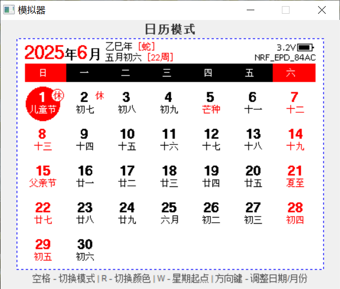

## 开发

> **注意:**
> - 推荐使用 [Keil 5.36](https://img.anfulai.cn/bbs/96992/MDK536.EXE) 或以下版本（如遇到 pack 无法下载，可到群文件下载）
> - `sdk10` 分支为旧版 SDK 代码，蓝牙协议栈占用的空间小一些，用于支持 128K Flash 芯片（不再更新）

这里以当前 nRF52 工程 (`Keil/EPD-nRF52.uvprojx`) 为例，项目配置有几个 `Target`：

- `nRF52811_xxAA`: 用于编译应用固件
- `flash_softdevice`: 用于安全中转并烧录 SDK 自带的蓝牙协议栈（只需刷一次）

烧录器可以使用 J-Link 或者 DAPLink（可使用 [RTTView](https://github.com/XIVN1987/RTTView) 查看 RTT 日志）。

**刷机流程:**

> **注意:** 这是自己编译代码的刷机流程。如不改代码，强烈建议到 [Releases](https://github.com/tsl0922/EPD-nRF5/releases) 下载编译好的固件，**不需要单独下载蓝牙协议栈**，且有 [刷机教程](https://b23.tv/AaphIZp) （没有 Keil 开发经验的，请不要给自己找麻烦去编译）

1. 全部擦除（Keil 擦除后刷不了的话，使用烧录器的上位机软件擦除试试）
2. 切换到 `flash_softdevice`，先执行一次 `Build`
3. 该 target 会把 SDK 中的官方 `s112_nrf52_7.3.0_softdevice.hex` 复制到 `Keil/_build_softdevice_nRF52/`，不会再直接把 SDK 目录当成输出目录
4. 对 `flash_softdevice` 执行 `Download`，刷入蓝牙协议栈（只需一次）
5. 切换到 `nRF52811_xxAA`，编译并下载应用固件

> **注意:**
> - 不要再把 Keil 的输出目录指向 SDK 的 `softdevice` 目录。`Clean Target` 会删除 target 输出文件，这样会误删 SDK 原始 SoftDevice 文件。
> - 如果 `flash_softdevice` 构建时报找不到 `s112_nrf52_7.3.0_softdevice.hex`，请先把该文件恢复到 `SDK/17.1.0_ddde560/components/softdevice/s112/hex/`。

### 晶振配置

本项目默认都没有使用外部低速晶振 (频率: `32.768kHz`)，因为不是所有的板子都有这个晶振，没有低速晶振的板子刷了开启低速晶振的固件是运行不起来的。
如果你的板子有外部低速晶振，建议修改为使用外部晶振，这样时钟走时会更准确一些。以下是修改方法：

**nRF51**

修改 `main.c`:

```c
#define NRF_CLOCK_LFCLKSRC      {.source        = NRF_CLOCK_LF_SRC_XTAL,             \
                                 .rc_ctiv       = 0,                                 \
                                 .rc_temp_ctiv  = 0,                                 \
                                 .xtal_accuracy = NRF_CLOCK_LF_XTAL_ACCURACY_20_PPM}
```
**nRF52**

修改 `sdk_config.h`:

```c
#define NRF_SDH_CLOCK_LF_SRC 1
#define NRF_SDH_CLOCK_LF_RC_CTIV 0
#define NRF_SDH_CLOCK_LF_RC_TEMP_CTIV 0
#define NRF_SDH_CLOCK_LF_ACCURACY 7
```

### 模拟器

本项目提供了一个可在 Windows 下运行界面代码的模拟器，修改了界面代码后无需下载到单片机即可查看效果。

仿真效果图：




**编译方法：**

下载并安装 [MSYS2](https://www.msys2.org) 后，打开 `MSYS2 MINGW64` 命令窗口执行以下命令安装依赖：

```bash
pacman -Syu
pacman -S make mingw-w64-x86_64-gcc
```

然后 cd 到项目目录，执行 `make -f Makefile.win32` 即可编译出模拟器的可执行文件。

**修改界面：**

修改 GUI 目录下的代码后，重新执行上面的 make 命令编译即可。

> **注意:** GUI 目录下的代码不可依赖平台相关的东西，比如单片机特有的 API 接口，否则在 Windows 下编译会失败。正确的做法是：在调用 `DrawGUI` 函数前就把数据算好并放到 `gui_data_t` 里，然后通过 `data` 参数传进去。
